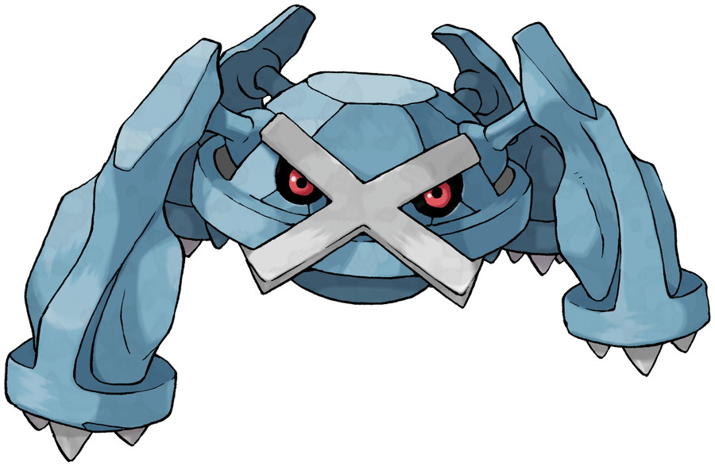

# Metagross



A CUDA-based paged and INT8-quantized KV-cache for transformer inference.

## Run

### 1. Requirements

- NVIDIA GPU with CUDA support
- CUDA Toolkit with `nvcc` available on `PATH`
- Python 3.9+

### 2. Create and activate a virtual environment

**macOS / Linux**

```bash
python3 -m venv .venv
source .venv/bin/activate
```

**Windows**

```powershell
python -m venv .venv
.venv\Scripts\activate
```

### 3. Install dependencies

```bash
pip install --upgrade pip
pip install torch pytest numpy transformers datasets matplotlib
```

### 4. Build and install Metagross

From the project root:

```bash
pip install -e . --no-build-isolation
```

### 5. Run the tests

Basic tests:

```bash
pytest tests/test_sanity.py tests/test_block_allocator.py -v
```

Full test suite:

```bash
pytest tests/ -v
```

The full suite requires the CUDA extension and an NVIDIA GPU.

### 6. Run GPT-2 generation

```bash
python -c "from metagross.generate import load_gpt2, generate_flashkv_fused; model, tokenizer = load_gpt2(device='cuda'); text, _, _, _ = generate_flashkv_fused(model, tokenizer, 'The capital of France is', max_new_tokens=20); print(text)"
```

### 7. Run TinyLlama generation

```bash
python -c "from metagross.generate_llama import load_tinyllama, generate_tinyllama_fused; model, tokenizer = load_tinyllama(device='cuda'); text, _, _, _ = generate_tinyllama_fused(model, tokenizer, 'Once upon a time,', max_new_tokens=20); print(text)"
```
